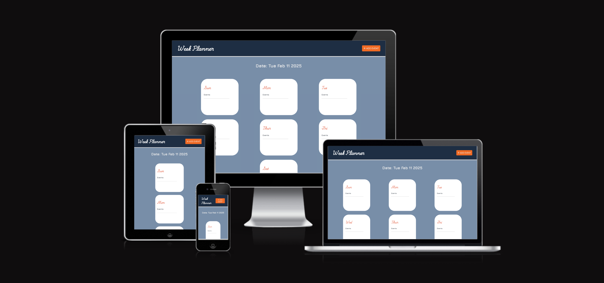

## Table of contents

- [Overview](#overview)
  - [Screenshot](#screenshot)
  - [Links](#links)
  - [User Targets](#user-targets)
  - [Aim](#aim)
  - [Wireframes](#wireframes)
  - [Color Palette](#color-palette)
  - [Typography](#typography)
- [Features](#features)
  - [Main Page](#main-page)
  - [Day Popup](#day-popup)
  - [New Event](#new-event)
- [My process](#my-process)
  - [Built with](#built-with)
  - [Continued development](#continued-development)
- [Validations](#validations)
  - [HTML](#html)
  - [CSS](#css)
- [Deployment](#deployment)
  - [Testing](#testing)
  - [Bugs](#bugs)
- [Credits](#credits)
  - [Useful Rescources](#useful-resources)
  - [Acknowledgments](#acknowledgments)

## Overview
Project Idea - Simple Weekly Event Planner 

### Screenshot

### Links
- Live Site URL: [Click Here!](https://t3mmy4p.github.io/milestone-project-2/)

### User Targets
- Self Employed
- Working From Home
- Admin Personel
- Event Planners/Organisers
- Project Managers
- Anyone working with a computer/laptop

### Aim
The motivation behind the idea for this project was to have better control over a busy weekly/monthly schedule. Juggling a busy schedule can feel overwhelming sometimes. Especially if like me your calendar is always choked up with upcoming events/jobs, it can make it difficult to keep on top of other minor tasks you might have in the week. 

This site allows you to create tasks (labelled as events) in a dedicated weekly calendar style planner quickly and efficiently.

### Wireframes

### Color Palette

### Typography
Source: Google Fonts

- Playwrite IN: 
  Used for the main header and day names on main page.

- Jura: 
  Used for the live date, event title and add event button on main page.
  Used for the day names and event details in pop up window.

- Museo Moderno: 
  Used for the created event name/title on main page and pop up window.
  Used for the labels in the new event window.

## Features
### Main Page

The main page takes it's inspiration from the calendar app view with each day having it's own "block" for created events to be listed. The color palette follows a simplistic design approach but is intended to be easy on the eyes for prologned viewing with the fonts adding a modern and edgy personality visually. 

A new event button is visible on the header to allow users to create events immediately.

### Day Popup

When each day is clicked a popup window appears. The popup is a quick and easy way to access events for specific days with a little more detail, including time & address (if included).

There is also a new event button to allow users create events directly from the popup window.

A delete button is also included (NOT YET FUNCTIONAL). This is intended to serve as a way to delete past events.
 - This will be implemented further over time.

### New Event

On clicking the new event button in the main page or popup window, a create event window appears.

This is straight forward as it allows users to create events by adding information available.

## My process
### Built with
- Semantic HTML5 markup
- CSS custom properties
- Flexbox
- CSS Grid
- Mobile-first workflow
- JavaScript 

### Continued development
Delete Icon:  
 - The delete icon in the popup window is not functional as of yet but the goal is implement it in a way that you can clicked/selected events.

Past Event:
 - Event detail background changes color when it's past due date.

Information Storage:
 - Information is stored on a different platform so information is not lost on refresh.

## Validations
### HTML

### CSS

## Deployment
The site was deployed to Git Hub pages using the following steps:

  - In the Github repository, click the Setting tab.
  - Under General, navigate to Code and Automation and select 'Pages'.
  - In the Build and Deployment section for Source, select 'Deploy from a branch' from the drop-down list.
  - For Branch, select 'main' from the drop-down list and Save.
  - On the top of the page, the link to the complete website is provided.
  - The deployed site will update automatically upon new commits to the master branch.

### Testing
 - Tested on different devices with varying screensizes and project renders well.

### Bugs
- Information is deleted on refresh

## Author
- Website - [Temitope Edwards](https://t3mmy4p.github.io/milestone-project-2/)

## Credits
### Useful resources
- [MDN Web Docs](https://developer.mozilla.org/en-US/)
- [YouTube](https://www.youtube.com/)

